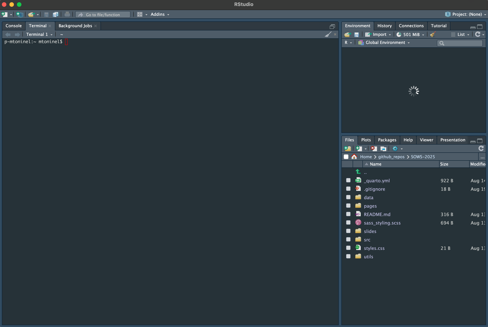

```{r setup, include=FALSE}
knitr::opts_knit$set(root.dir = normalizePath('../'))
knitr::opts_chunk$set(echo = TRUE, fig.align = 'center', warning = FALSE, message = FALSE)
```

## Objectives 🎯
- _Setup RStudio_
- _Get familiar with the interface_
- _Download relevant packages and set up the computing environment_

# Setup
## Downloading the workshop contents
In order to have everything ready to go through the steps of the workshop, we first need to download the required materials. To do so, click on [this link](https://github.com/paganilab/sows-2025/archive/refs/heads/master.zip). This should trigger a file download on your system. 

> Keep track of the location of the download! We will now head into this folder using `R` through the `Rstudio` interface.

## Initializing Rstudio
Once RStudio is installed on your computer and opened, you should be able to see something like the following interface:

<center>



</center>

This is your working interface, the **bottom right section** shows your _current file system_. The **section on the left currently displays your console**, where **you can type `R` code _interactively_**. 

## Creating a new R project for the workshop
Go ahead and create a new `R project` by cliking on `File` > `New Project` and name it what you want. You can think of a project as a container of everything we will use during our workshop both in terms of files as well as `R` objects. When you create the project, select the option to create it from an existing folder, and use the folder you just downloaded which should be named `sows-2025-master` to initialize it.
Now, using the navigation menu on the bottom right, you should be able to head to the folder we just downloaded! You should see it contains a set of files including a folder named `data`. 

> ⚠️ To make sure that everything is working properly, run the following command in your console `getwd()` and **make sure that the output path that is returned ends with `sows-2025-master`!**

## Installing packages
The analyses that we are going to conduct require specific **packages**. In R, **packages are _collections of functions_** which help us perform standardized workflows. In the **code chunk** below, we instruct R to install the packages that we will need later on throughout the workshop.

> 💡
> **Copy and paste this and the other _code chunks_ from here to your R script to follow.**

```{r, eval=FALSE}
# Install required packages for subsequent analyses
source("./utils/installations.R")
```

During the installation, you will see many messages being displayed on your _`R` console_, don't pay too much attention to them unless they are <span style="color: red;">red and specify an error</span>!

If you encounter any of these messages during installation, follow this procedure here:

```{r, eval=FALSE}
# R asks for package updates, answer "n" and type enter
# Question displayed:
Update all/some/none? [a/s/n]:

# Answer to type:  
n

# R asks for installation from binary source, answer "no" and type enter
# Question displayed:
Do you want to install from sources the packages which need compilation? (Yes/no/cancel)

# Answer to type:
no
```

# Warm-up: Load the libraries
Once everything is correctly installed, we can _load_ the required libraries that we will use during the workshop. Take this line and paste it in your console:

```{r}
# Load required packages for subsequent analyses
source("./utils/load_libraries.R")
```

Hopefully all packages were correctly installed and now we can dive a bit deeper into the world of spatial data analysis!
